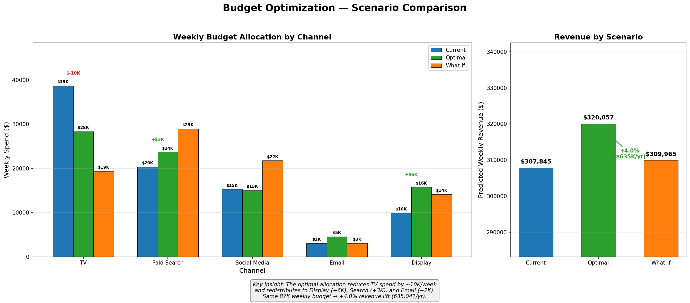
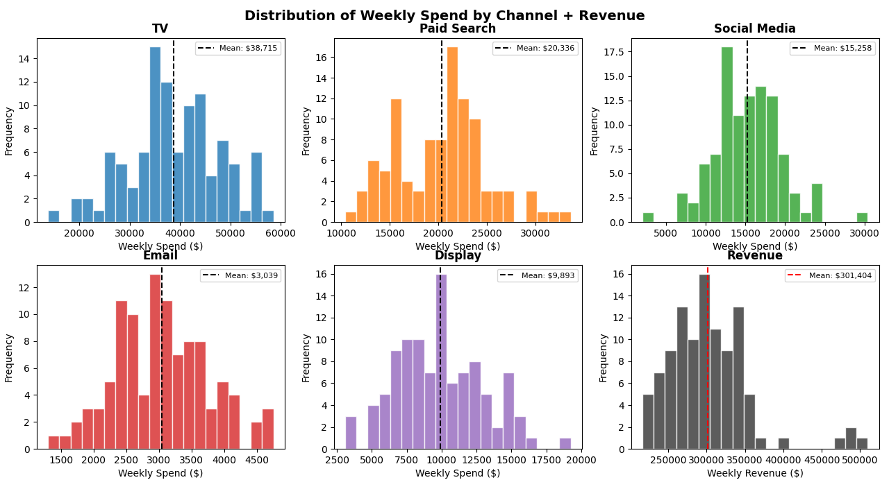
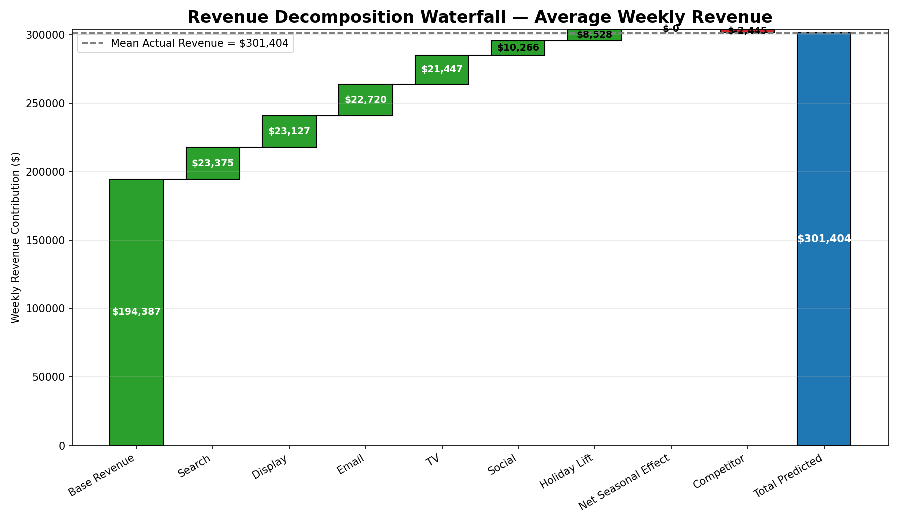
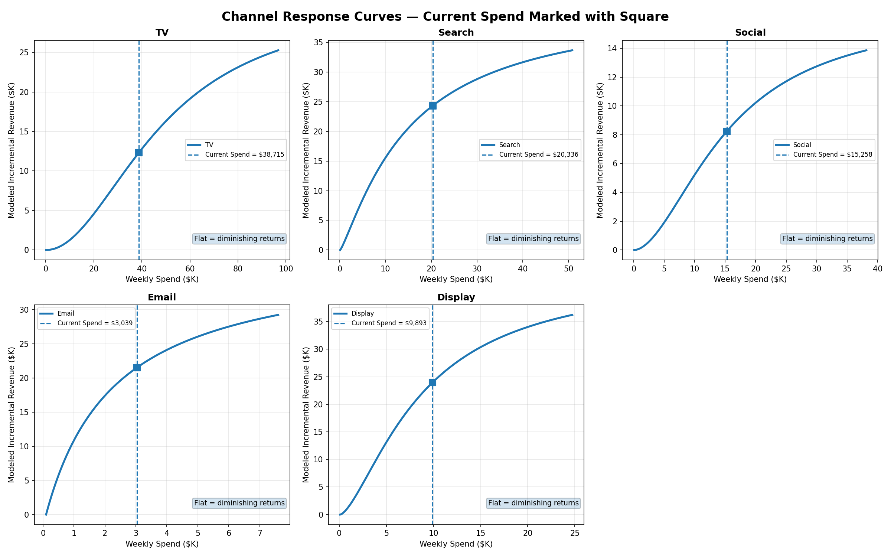
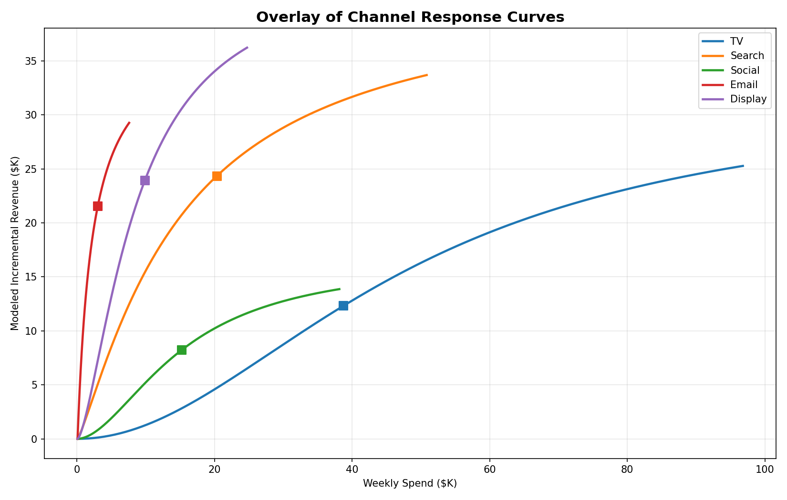
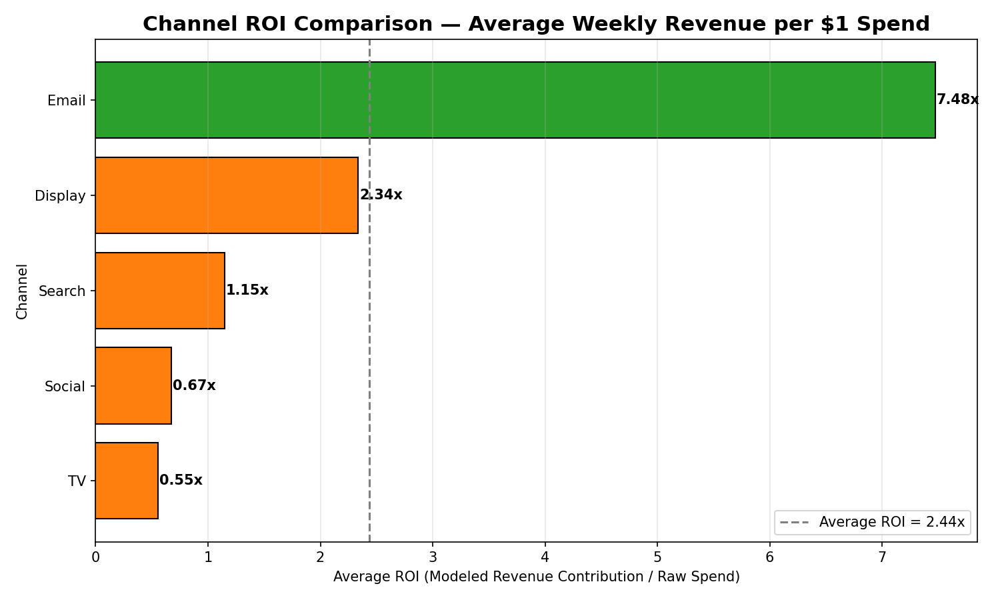
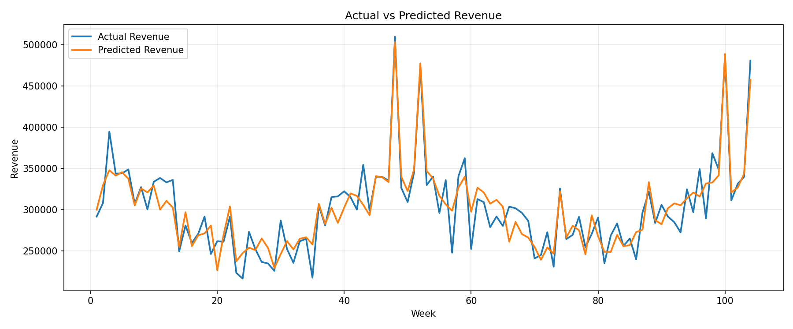
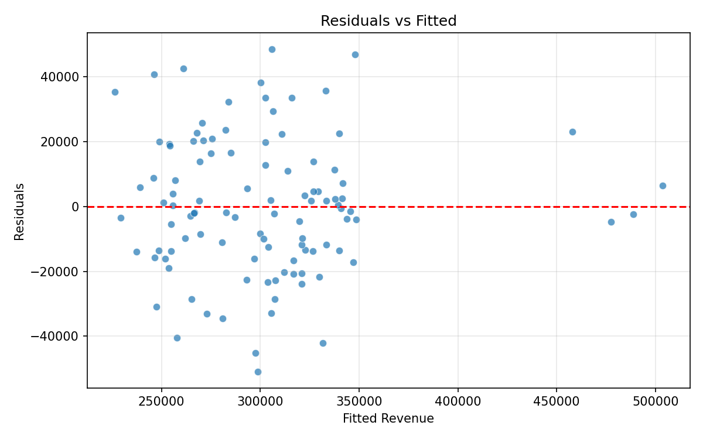
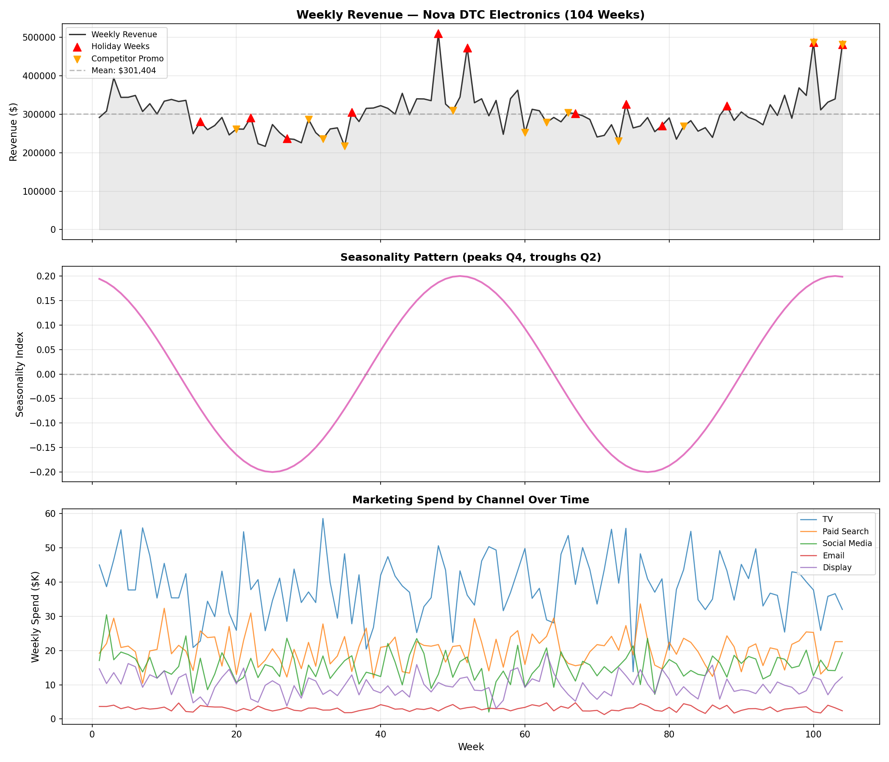
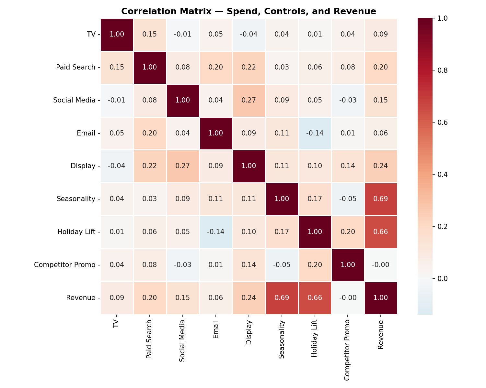

# Marketing Mix Model: Multi-Channel Budget Optimization

> **Built a Marketing Mix Model with adstock transformations and Hill saturation curves across 5 channels, decomposing revenue contribution and optimizing a $4.5M annual marketing budget to project +$635K incremental revenue lift — with zero additional spend.**



---

## Table of Contents

- [Why I Built This](#why-i-built-this)
- [Business Problem](#business-problem)
- [Methodology](#methodology)
- [Project Architecture](#project-architecture)
- [Data Overview](#data-overview)
- [Key Results](#key-results)
- [Visualizations](#visualizations)
- [How to Run](#how-to-run)
- [File Structure](#file-structure)
- [What I Learned](#what-i-learned)
- [Contact](#contact)

---

## Why I Built This

I was interested in this project because marketing analytics feels like one of the clearest places where business thinking and technical problem-solving actually meet. I did not want to just build something that looked impressive on the surface, I wanted to understand how a model could turn messy channel data into a recommendation that a decision maker could actually use. MMM stood out to me because it goes beyond reporting what happened and tries to explain why it happened, which made it feel much closer to real strategy work.

What I am most proud of is that this project pushed me past just writing code that runs. I had to work through concepts like adstock, saturation, controls, decomposition, and validation, then make sure the model was something I could defend and explain clearly. That is the kind of work I want to do after graduation, using data to solve business problems, communicate insights, and help make better decisions instead of just producing dashboards or surface-level analysis.

---

## Business Problem

Nova DTC Electronics spends **$87,240 per week (~$4.5M/year)** across 5 marketing channels but has no data-driven way to answer three questions:

1. **Which channels actually drive revenue** vs. merely correlate with it?
2. **Where are we overspending** past the point of diminishing returns?
3. **How should we reallocate** to maximize revenue without increasing budget?

Without a model, budget decisions default to intuition and last year's allocation, leaving significant revenue on the table.

---

## Methodology

This project follows a 6-phase modeling pipeline, each building on the last:

### Pipeline Overview

```
Raw Spend Data → Adstock Transform → Hill Saturation → OLS Regression → Decomposition → Budget Optimization
```

| Phase | What It Does | Key Concept |
|-------|-------------|-------------|
| **1. Parameter Research** | Validated decay rates, Hill slopes, and saturation points against published MMM literature | Adstock half-life = `log(0.5) / log(decay_rate)` |
| **2. Transformations** | Applied geometric adstock (carryover) and Hill saturation (diminishing returns) to raw spend | Performance channels (Search, Email) get concave curves (slope ≤ 1) |
| **3. Feature Engineering** | Normalized and transformed all 5 channels into regression-ready features | 15 new columns: `{channel}_adstocked`, `_normalized`, `_saturated` |
| **4. Regression** | OLS regression with 3 control variables (seasonality, holidays, competitor promos) | All coefficients positive, R² strong, residuals well-behaved |
| **5. Decomposition** | Waterfall attribution: how much revenue does each channel (and control) contribute? | Base revenue = 64% of total ($194K/week organic) |
| **6. Optimization** | `scipy.optimize.minimize` to find the budget allocation that maximizes predicted revenue | Same $87K budget → +4% revenue lift ($635K/year) |

### Key Technical Decisions

- **Geometric adstock** over Weibull: simpler, interpretable, validated against Meta Robyn and Google Meridian docs
- **Hill saturation** with channel-specific slopes: performance channels (Search, Email) have slope ≤ 1 (concave); brand channels (TV, Social) have slope > 1 (S-curve)
- **OLS over Bayesian**: appropriate for a synthetic dataset with known ground truth; Bayesian (PyMC-Marketing) would be the next step for real data with uncertainty quantification
- **Controls matter**: seasonality (r = 0.69 with revenue) and holiday lift (r = 0.66) are the strongest raw correlations; without controlling for them, channel coefficients would be biased

### Validation Sources

Parameters were validated against: Meta Robyn documentation/GitHub, Google Meridian docs, Joseph MPRA Paper 7683, Improvado MMM guide, PyMC-Marketing tutorials, Analytic Partners ROI Genome, and Keen Decision Systems benchmarks.

---

## Project Architecture

```
Marketing-Mix-Modeling-Project/
│
├── config.py                          # All model parameters (decay rates, Hill params, spend ranges)
├── transforms.py                      # Adstock, saturation, normalization functions
├── generate_data.py                   # Synthetic dataset generator (104 weeks, 5 channels)
├── eda.py                             # Exploratory data analysis + visualizations
├── phase3_build_transformed_features.py   # Applies adstock → normalize → saturate pipeline
├── phase4_mmm_regression.py           # OLS regression + diagnostics
├── phase5_decomposition_waterfall.py  # Revenue attribution waterfall
├── phase5_roi_bar_chart.py            # Channel ROI comparison
├── phase5_response_curves.py          # Spend vs. incremental revenue curves
├── phase6_budget_optimizer.py         # scipy.optimize budget allocation
├── phase6_scenario_comparison.py      # Current vs. Optimal vs. What-If scenarios
│
├── images/                            # All chart outputs
│   ├── phase5_waterfall_chart.png
│   ├── phase5_response_curves_grid.png
│   ├── phase5_roi_bar_chart.png
│   ├── phase6_executive_scenario.png
│   └── ...
│
├── mmm_dataset.csv                    # Generated dataset (104 rows × 11 columns)
├── mmm_dataset_transformed.csv        # With adstock/saturation features (104 × 26 columns)
├── phase6_scenario_table.csv          # Scenario comparison export
│
├── MMM_Executive_Deck.pptx            # 10-slide executive presentation
├── MMM_Executive_Summary.pdf          # 1-page C-suite summary
└── README.md                          # This file
```

---

## Data Overview

**104 weeks** of simulated weekly data for a DTC electronics brand across **5 paid channels** and **3 control variables**.

| Channel | Avg Weekly Spend | Range | % of Budget | Adstock Decay | Hill Slope |
|---------|-----------------|-------|-------------|--------------|------------|
| TV | $38,715 | $14K – $59K | 44% | 0.70 | 1.5 |
| Paid Search | $20,336 | $10K – $34K | 23% | 0.20 | 0.7 |
| Social Media | $15,258 | $2K – $30K | 17% | 0.50 | 1.2 |
| Email / CRM | $3,039 | $1K – $5K | 3% | 0.20 | 0.6 |
| Display | $9,893 | $3K – $19K | 11% | 0.30 | 0.8 |

**Controls:** Seasonality index (peaks Q4, troughs Q2), holiday flags (Black Friday +75%, Christmas +60%), competitor promotions (−8% revenue impact).

**Target:** Mean weekly revenue = **$301,404** (~$15.7M/year).



---

## Key Results

### Revenue Decomposition

Base (organic) revenue accounts for **64%** of total weekly revenue ($194,387). The remaining 36% is attributed to paid media, holidays, and seasonality.

| Component | Weekly Contribution | % of Revenue |
|-----------|-------------------|-------------|
| Base Revenue | $194,387 | 64% |
| Paid Search | $23,375 | 8% |
| Display | $23,127 | 8% |
| Email | $22,720 | 8% |
| TV | $21,447 | 7% |
| Social Media | $10,266 | 3% |
| Holiday Lift | $8,528 | 3% |
| Competitor Effect | −$2,445 | −1% |

### Channel ROI

| Channel | ROI (Revenue per $1 Spent) | Verdict |
|---------|---------------------------|---------|
| Email | **7.48x** | 🟢 Highest — constrained by list size, not budget |
| Display | **2.34x** | 🟢 Strong — room to scale |
| Search | **1.15x** | 🟡 Moderate — solid performance channel |
| Social | **0.67x** | 🟠 Below breakeven at margin |
| TV | **0.55x** | 🔴 Lowest — deep in diminishing returns |

### Budget Optimization

The optimizer reallocates the **same $87K weekly budget** to maximize predicted revenue:

| Channel | Current | Optimal | Change |
|---------|---------|---------|--------|
| TV | $38,715 (44%) | $28,328 (32%) | **−$10,387** |
| Paid Search | $20,336 (23%) | $23,665 (27%) | +$3,329 |
| Social Media | $15,258 (17%) | $14,976 (17%) | −$281 |
| Email | $3,039 (3%) | $4,540 (5%) | +$1,501 |
| Display | $9,893 (11%) | $15,730 (18%) | **+$5,837** |

**Result: +$12,212/week → +$635,024/year (4.0% lift) with $0 additional spend.**

---

## Visualizations

### Revenue Decomposition Waterfall


### Channel Response Curves
Each channel's spend-to-revenue relationship. Square markers show current spend levels. Flat regions = diminishing returns.





### ROI Comparison


### Budget Optimization Scenarios


### Model Diagnostics
Actual vs. Predicted revenue tracks closely. Residuals are centered at zero with no systematic pattern. Q-Q plot confirms approximate normality.





### Exploratory Data Analysis




---

## How to Run

### Requirements

```
Python 3.10+
numpy
pandas
matplotlib
scipy
statsmodels
```

### Installation

```bash
git clone https://github.com/yrgomar/Marketing-Mix-Modeling-Project.git
cd Marketing-Mix-Modeling-Project
pip install -r requirements.txt
```

### Run the Full Pipeline

```bash
# 1. Generate synthetic dataset
python generate_data.py

# 2. Exploratory data analysis
python eda.py

# 3. Apply adstock + saturation transformations
python phase3_build_transformed_features.py

# 4. Run OLS regression + diagnostics
python phase4_mmm_regression.py

# 5. Revenue decomposition + ROI charts
python phase5_decomposition_waterfall.py
python phase5_roi_bar_chart.py
python phase5_response_curves.py

# 6. Budget optimization + scenario comparison
python phase6_budget_optimizer.py
python phase6_scenario_comparison.py
```

Each script is self-contained and prints results to the console + saves PNG charts.

---

## File Structure

| File | Purpose |
|------|---------|
| `config.py` | Validated parameters — decay rates, Hill slopes, spend ranges, holiday lifts |
| `transforms.py` | Core functions: `adstock_geometric()`, `hill_saturation()`, `normalize_spend()`, `apply_pipeline()` |
| `generate_data.py` | Generates 104-week synthetic dataset with realistic noise and seasonality |
| `eda.py` | Time series, distributions, correlation matrix, scatterplots |
| `phase3_build_transformed_features.py` | Applies the full adstock → normalize → saturate pipeline |
| `phase4_mmm_regression.py` | OLS regression with diagnostics (residuals, Q-Q, VIF) |
| `phase5_*.py` | Decomposition waterfall, ROI bar chart, response curves |
| `phase6_*.py` | Budget optimizer (`scipy.optimize`) and scenario comparison |

---

## What I Learned

This project changed how I think about marketing spend because it forced me to look past simple correlations and really think about what is driving revenue. The hardest concept for me was adstock, especially the half-life formula and how decay rates affect the whole model. Once I understood that a TV ad can keep influencing sales for weeks while search fades much faster, it clicked for me that using the wrong decay rate can throw off everything and lead to bad recommendations. I was also surprised by how much seasonality and holidays dominated the raw relationships, which showed me why controls are essential if you want to measure marketing honestly.

What made the project feel more real was seeing how decomposition worked after the regression. That was the point where it became personal for me, because it reminded me of ideas from COB 291 and helped me connect the math to an actual business story. With real data, I would spend much more time validating assumptions and checking whether the model is actually defensible, not just technically correct. More than anything, this project made me think about marketing less as which channel looks best, and more as which channel still has room to grow and why.

---

## Contact

**Omar Oudrari**
- Email: oudraroa@dukes.jmu.edu
- GitHub: [github.com/yrgomar](https://github.com/yrgomar)
- LinkedIn: [linkedin.com/in/omaroudrari](https://linkedin.com/in/omaroudrari)

---

*Built as part of a data analytics portfolio. Methodology informed by Meta Robyn, Google Meridian, and published MMM research.*
